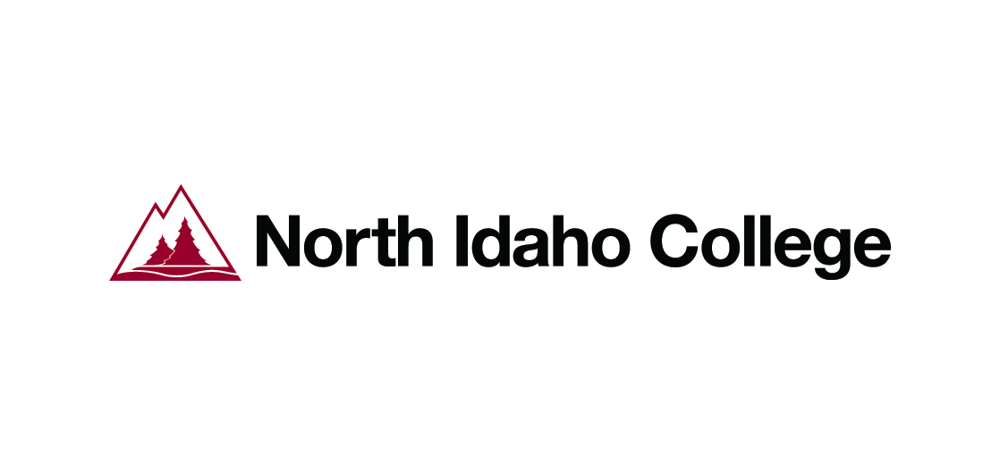
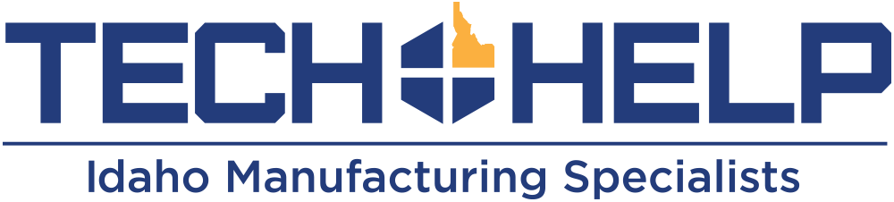
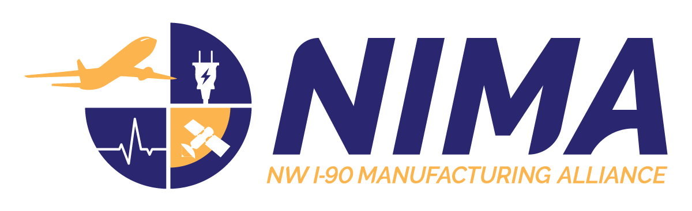

# Robotics and AI Bootcamps 2025
Welceome to the 2025 Robotics and AI Bootcamps hosted by the Center for Intelligent Industrial Robotics at the University of Idaho!

## About
The 2025 Robotics and AI Bootcamps will take place June 9-13th, 2025. All will be offered in-person in the Hedlund Building (2nd floor) on the North Idaho College campus in Coeur d'Alene Idaho. Topics covered include Robotics, Embedded Systems, Data Science, and AI. Workshops will take place 9am-5pm in 2 or 4 hour blocks, with a break for (free!) lunch each day. Space is limited, so register early! You need not register for all days or all workshops on each day - feel free to attend those most interesting to you. 

*All workshops require a laptop computer. If you do not have a laptop, please contact us ASAP to see if there is one available for use*

*No prior programming experience required. However, many workshops will operate under the assumption that a python programming environment is installed - if you do not already have one set up, consider coming to the first workshop on Day 1 so we can help you do so.*

## Schedule and Descriptions

## Register 
You can register for the workshops here or by scanning the QR code below. Space is limited, so register early!

## Sponsors
Our main sponsor is Idaho Forest Group, who is generously providing lunch every day of the bootcamp. Thank you IFG! 

### Content Sponsors
Content for the workshop is additionally supported by the following partner organizations: 

## Location 
Hedlund Building Room 202

420 North College Drive

Coeur d'Alene, ID 83814

*Parking is free during the summer.* 