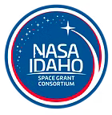

# Robotics and AI Bootcamps 2025
Welceome to the FREE 2025 Robotics and AI Bootcamps hosted by the Center for Intelligent Industrial Robotics at the University of Idaho!

## About
The 2025 Robotics and AI Bootcamps will take place June 9-13th, 2025. They are designed for adults ages 18+. All will be offered in-person in the Hedlund Building (2nd floor) on the North Idaho College campus in Coeur d'Alene, Idaho. Topics covered include Robotics, Embedded Systems, Data Science, and AI. Workshops will take place 9am-5pm in 2 or 4 hour blocks, with a break for (free!) lunch each day. Space is limited, so register early! You need not register for all days or all workshops on each day - feel free to attend those most interesting to you. 

*All workshops require a laptop computer. If you do not have a laptop, please contact us ASAP to see if there is one available for use*

*No prior programming experience required. However, many workshops will operate under the assumption that a python programming environment is installed - if you do not already have one set up, consider coming to the first workshop on Day 1 so we can help you do so.*

*Please note in the registration if you plan to attend any of the workshops only via Zoom. A zoom link will be emailed to the email address provided in the form.* 

*Zoom is not available for all workshops. Most workshops with a physical lab component do not have a zoom session.*

## Schedule and Descriptions

### Day Theme Breakdown 

| Mon June 9 | Tues June 10 | Wed June 11 | Thurs June 12 | Fri June 13th| 
| :----: | :----: | :----: | :----: | :----: | 
|Data and Programming Intro Day | Electronics and Sensors Day | Robotics and PLCs Day | Machine Vision Day | AI Day | 

### Detailed Schedule 

#### Monday, June 9th - Data and Programming Intro Day
| Date | Time | Workshop Name | Workshop Description | Zoom Available? |
| :----: | :----: | :----: | :----: | :----: | 
|6/9/25|9:00am - 10:50am|Introduction and Setting Up a Python Environment|  Participants will learn how to install a python environment on their laptop along with an integrated development environment (IDE). The basics of the python programming language will also be covered.     |Yes|
|6/9/25|10:50am - 12:45pm|Basics of Data Manipulation with Python/Pandas|  Participants will learn the basics of using the Pandas python library to manipulate data. Cleaning datasets, filtering datasets, and visualizing information via graphs will be covered.     |Yes|
|6/9/25|12:45pm - 1:20pm| Lunch | | 
|6/9/25|1:20pm - 3:10pm|Data Visualization with Grafana|  Participants will use Grafana Cloud to query data and display it with maps, graphs, and charts on a customizable dashboard. One project will involve mapping NASA’s meterorite collision dataset.     |Yes|
|6/9/25|3:10pm - 5:00pm|Time Series Data|   Fundamental concepts, concepts, and issues specific to time series data will be covered. Participants will work to clean time series datasets and learn aggregation, interpolation, and sequencing strategies.    |Yes|

#### Tuesday, June 10th - Electronics and Sensors Day
| Date | Time | Workshop Name | Workshop Description | Zoom Available? |
| :----: | :----: | :----: | :----: | :----: | 
|6/10/25|9:00am - 10:50am|Design a Custom Printed Circuit Board (PCB)|  Participants will design a simple battery-operated LED circuit board using the KiCad software. Participants will learn how to lay out the circuit diagram, place and connect components, and prepare the files for the circuit board to be manufactured.     |Yes|
|6/10/25|10:50am - 12:45pm|Soldering|  Participants will learn the basics of soldering, and put together the printed circuit board designed in the previous workshop with a soldering iron and the associated electronic components. At the end, participants will have a working battery-operated LED.    |No|
|6/10/25|12:45pm - 1:20pm| Lunch | | | |
|6/10/25|1:20pm - 3:10pm|Arduino|  Participants will download and learn the basics of using the Arduino IDE to control a microcontroller reading in from a temperature sensor.     |No|
|6/10/25|3:10pm - 5:00pm|Raspberry Pi|  Participants will learn the basics of using a single board raspberry pi computer and how to control a servo motor with it using python.     |No|

#### Wednesday, June 11th - Robotics and PLCs Day
| Date | Time | Workshop Name | Workshop Description | Zoom Available? |
| :----: | :----: | :----: | :----: | :----: | 
|6/11/25|9:00am - 10:50am|Control a Robot|    Participants will use the Python programming language to control a Fanuc, StandardBot, or UR Robot. Participants will use their laptop and written program to communication directly with and control the robot.   |No|
|6/11/25|10:50am - 12:45pm|3D Modeling| Participants will learn the basics of using an online CAD software to make a small 3D model. How to print models with 3D printers will also be covered.      |No|
|6/11/25|12:45pm - 1:20pm| Lunch | | | |
|6/11/25|1:20pm - 5:00pm|Programmable Logic Controllers (PLCs)| Participants will learn how to connect to a PLC and control it using ladder logic programming.      |No|

#### Thursday, June 12th - Machine Vision Day
| Date | Time | Workshop Name | Workshop Description | Zoom Available? |
| :----: | :----: | :----: | :----: | :----: | 
|6/12/25|9:00am - 10:50am|OpenCV with Python| Participants will learn basic image manipulations in the Open Computer Vision (OpenCV) library of the python programming language. Thresholding and edge detection will be covered.      |Yes|
|6/12/25|10:50am - 12:45pm|Basic Neural Networks for Machine Vision|Partiipants will learn the Convolutional Neural Network (CNN) architecture and implement it using the Keras library in Python. The planned project involved classifying landmarks on Mars using the NASA HiRISE dataset.       |Yes|
|6/12/25|12:45pm - 1:20pm| Lunch | | | |
|6/12/25|1:20pm - 5:00pm|Object Detectors|Participants will gather, annotate, and train an object detector for an object of their choice. Participants will first choose an object, then be tasked with taking 50-100 images in varying positions and lighting conditions of the object. Participants will upload the dataset, learn to annotate it in the CVAT software, and train a YOLOv8 object detector to recognize the object.       |Yes|

#### Friday, June 13th - AI Day
| Date | Time | Workshop Name | Workshop Description | Zoom Available? |
| :----: | :----: | :----: | :----: | :----: | 
|6/13/25|9:00am - 10:50am|AI Overview and Coding Environments|Participants will learn a taxonomy of different fundamental AI models and a brief overview of how they work. Participants will also learn about different hardware and software requirements for AI models, and about programming environments that support them.       |Yes|
|6/13/25|10:50am - 12:45pm|Decision Trees|Participants will learn the fundamentals behind the decision tree machine learning model, how to implement it in the scikit-learn library, and how related models (like Random Forest and XGBoost) work. The planned project involves classifying an example manufacturing dataset.       |Yes|
|6/13/25|12:45pm - 1:20pm| Lunch | | | |
|6/13/25|1:20pm - 3:10pm|Neural Networks|  Participants will learn how basic neural networks work, and hoe neural networks are the broad family of many popular deep learning techniques. Participants will implement a neural network using the Keras library.     |Yes|
|6/13/25|3:10pm - 5:00pm|Explainable AI, Large Models, and Beyond | Participants will learn about concerns for explainable AI, how large language models and transformers work, and current state-of-the-art research and future directions in AI.      |Yes|

## Register 
You can register for the workshops [here](https://uidaho.co1.qualtrics.com/jfe/form/SV_9yKoctF7KbA4dYa) or by scanning the QR code below. Space is limited, so register early!

## Sponsors
Our main sponsor is Idaho Forest Group, who is generously providing lunch every day of the bootcamp. Thank you IFG! 

### Content Sponsors
Content for the workshop is additionally supported by the following partner organizations: 

| Content Sponsors | 
| :----: |
||
||
||
||

## Location 
Hedlund Building Room 202

420 North College Drive

Coeur d'Alene, ID 83814

*Parking is free during the summer.* 