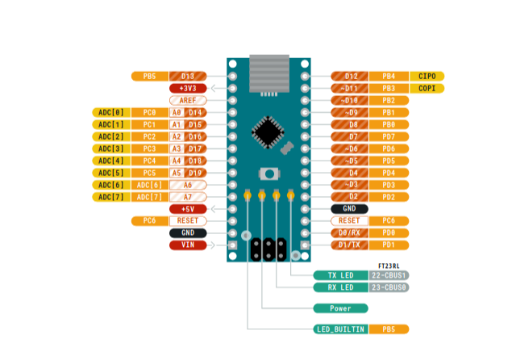
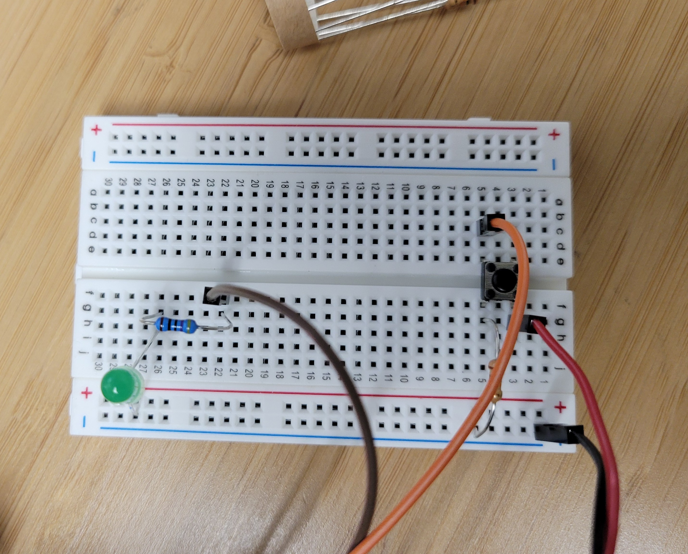
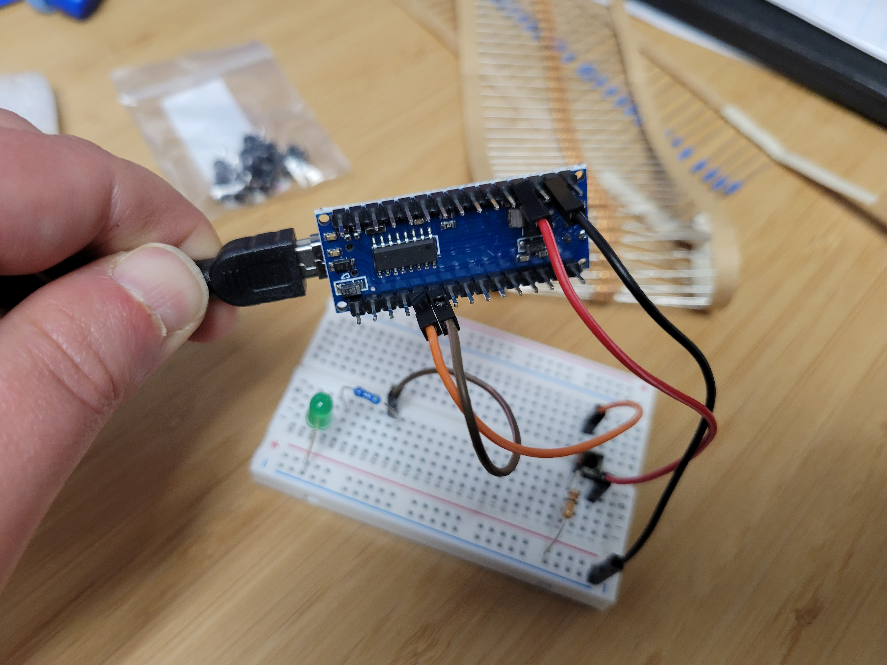
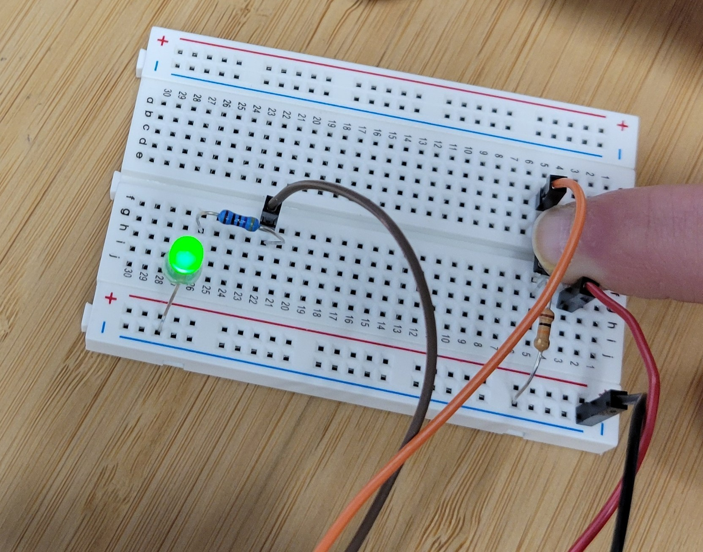

# Arduino Workshop
June 2025
We are directly using the code and tutorial from [The Robotics Back-End Website](https://roboticsbackend.com/arduino-turn-led-on-and-off-with-button/)

## Download the Arduino IDE
For this project, you will need the Arduino IDE downloaded. You can [download the IDE from the Arduino website linked here, for basically any operating system](https://www.arduino.cc/en/software/). This may take a few minutes, so you'll want to start earlier. **You definitely want the software installed with the recommended libraries**. 


## Introduction to Embedded Systems
In this day and age, you probably interact with computers a lot, whether via a smartphone or a PC. You are most likely used to interacting with a fairly powerful processor which can handle connections with Wifi and Bluetooth, find printers, take pictures, edit word documents, and display videos. You are most likely already aware that the smart devices you interact with run on computers. 

Embedded systems is a broad term, but it usually refers to:
- More limited computer processors running a specific set of functions, and/or
- Computers running on devices where the user is not interacting directly with computer functions

Our major professor's favorite example is a toaster (and we make fun of that all the time). A toaster is embedded system. A computer is controlling the heating curve, and the level of toastiness of your bread, and whether or not to assume you are heating up a bagel. You are interacting with your toaster by pushing buttons or levels or setting dials. But you aren't using a mouse and opening up the Toaster.OS or playing a video on your toaster (probably). The toaster is an embedded device, running very specific software on startup, with a very specific set of ways the user can interact with the device. It's not a general purpose machine -- but it is (hopefully) a very reliable one. It also effectively controls a set of hardware that "makes stuff happen". 

An embedded system might be have an actuator (something that moves or does something physical in 'the real world'), or it might not (like a sensor, for example). Sometimes embedded system are primarily for inputs (sensing, measuring) or primarily for outputs (moving a motor), but often they are for both. For example, SCARECRO sensing system we work on primarily collects weather sensing inputs, but it does have an actuator output in the form of a fan we can automically turn on if the processor is too warm. 


## Arduino Nano 
Some of the most popular beginner embedded systems projects use an Arduino device. The Arduino Nano we'll be working with is a microcontroller (which is exactly what is sounds like - a mini-computer). 

[The documentation for the Arduino Nano is linked here](https://docs.arduino.cc/hardware/nano/)

You can see from the board that it has a few features (picture from the documentation):



1. A blinking LED light (on basically every Arduino device, there is an onboard light, usually on pin 13). This light is a basic way to test programming connection, and is very useful. 

2. General Purpose Input/Output pins, which are also called GPIO or IO pins for short. 
    - These pins are programmable. You can choose whether to supply electricity to these pins or not. You can also choose whether these pins will receive electricity or not. 
    - The GPIO pins are one of the main reasons you choose to use a microcontroller or not. The GPIO pins are what allow you to connec to **other electrical components**. By supplying electricity (or not), you can turn connected components on or off, or send signals to the connected components. 
    - Some GPIO pins can accept 1 type of signal: on (voltage) or off (no voltage). These pins are called **Digital Pins**.
    - A specialized subset of pins can read a **varying voltage signal** from an electrical source. These are called **analog** pins, and you can read in levels of electricity, which often allows you to do things like vary resistance or modulate a signal. 
    - A few of these pins are used for powering devices (at 3.3V or 5V, depending on the pin) or supplying a ground source. 
3. A USB Power Supply - plugging this into your laptop will allow you both to power the Arduino Nano as well as program it, by transferring data from your computer to the device. You can also power an already-programmed Nano from a battery, with a some special wiring. 

The Arduino Nano is slightly less popular than the Arduino Uno, which a larger and more fully-featured board. However, we had like 20 Arduino Nanos, so that is definitely what we went with for the workshop. 

You program the Nano with the Arduino IDE. Let's walk through that next. 


## Blinking the onboard LED
We are going to learn the very basics of the Arduino software by using the IDE. To start, open your downloaded IDE. It will probably default to a blank "sketch". The sketch is programmed in a version of C++ -- so congratulations on making it to one of the very few non-python workshops we offer!

The sketch has two main components:

1. A setup() function
2. A loop() function 

### setup() function
This function initializes the things you'll want for your program before the program begins to run. This includes setting modes of the pins (inputs or outputs), creating variables to store values of interest, and initializing any library classes you might have pulled in. 

### loop() function
The loop function runs what is in the body of the function forever, for however long the device is powered on. It will go through the code sequentially, following the logic. When the loop function reaches the end of the code, it starts over from the top. 

Programming embedded systems in this manner is not difficult, but it may take some getting used to if you are more familiar programming something which steps through code and then exits. 

Another interesting thing about embedded systems programming is that global variables really aren't that uncommon - whereas in pretty much any other programming paradigm, using a global variable is only slightly less evil than setting a building on fire. 

### IDE Buttons
You should see several buttons at the top of the IDE. 
- The checkmark button **compiles** your program. It checks for errors in your code. If it finds one, it will throw a displayed error with what you should fix. 
- the right arrow **uploads** your completed program (only if it compiled correctly) to the connected device. 

There are also some useful menu functions. 

Go to:

- File
    - Examples
        - 01. Basics
            - Blink

This should open a pre-made example from the Arduino folks to blink your built-in LED light. 

Here's what the code does:

```bash
void setup() {
  // initialize digital pin LED_BUILTIN as an output.
  pinMode(LED_BUILTIN, OUTPUT);
}
```
This block takes the LED_BUILTIN pin number (which is handy alias for pin 13) and sets it to "output" mode. This means we'll be sending signals to the pin to make it do something, in this case, turn on the light. 

```bash
void loop() {
  digitalWrite(LED_BUILTIN, HIGH);   // turn the LED on (HIGH is the voltage level)
  delay(1000);                       // wait for a second
  digitalWrite(LED_BUILTIN, LOW);    // turn the LED off by making the voltage LOW
  delay(1000);                       // wait for a second
}
```
The loop function is doing 4 things:
- writing a HIGH (on) voltage to the LED pin, which turns on the light
- delaying 1000 ms (1 second) 
- writing a LOW to the LED pin
- delaying 1 second

Since this is a loop function, it will run the on/wait/off/wait code again and again, creating a blinking effect. If you didn't have the wait built in, it would turn the light on and off so fast it wouldn't be visible to your eyes. 


## Verifying your board 
By default, the Arduino IDE is most likely going to assume that you are using an Arduino Uno. You need to change that. Go to:
- Tools
    - Board
        - Arduino AVR Boards
            - Arduino Nano 

to select that board. 

## Choosing the Correct COM port
*Hopefully* (in purposeful italics), the USB port you have plugged the Nano into is selected by default. You may need to go to 
- Tools
    - Port

And select a different port if you have any issues. If you are using a Linux device, you may have to give your computer permission to access the USB ports, but that is not typically needed. To troubleshoot a port problem, you may have to use the old IT standy of unplugging and plugging back in. 

## Compile and Upload. 
Press the checkbox in the IDE to compile. When finished, press the arrow to upload. You should see the onboard light start blinking!

## Troubleshooting

You may have a bootloader issue. You may have to select
- Tools
    - Processor
        - ATmega328P (Old Bootloader)
to get it working.

Sometimes the USB connection is just faulty, and pressing the upload button again will work. 

Sometimes its a USB permissions problem. 

## Main Project Introduction
The main project we'll be working on in this workshop comes from [The Robotics Back End website](https://roboticsbackend.com/arduino-turn-led-on-and-off-with-button/) and uses a button to turn an LED on and off. When you push the button, the light turns on, and when you release it, the light turns off again. 


## The Components
1 Breadboard 
4 M-F Jumper Wires 
1 470 Ohm Resistor
1 220 Ohm Resistor
1 push button
1 LED 
1 USB Cord
1 Arduino Nano 

## Components Explanation 

### Breadboard
The breadboard is used to connect components, by using rows and rails. 

The rails are the blue and red strips on the sides. Everything within one strip is connected to everything else in the strip. There are called the power rails, since you typically use the red rail to connect all you power sources, and the blue rail to connect your ground sources. The rails on either side of the board are not connected to each other, however. Nothing on one side of the center divider is connected to anything on the other side. 

The rows are the sets of 5 differently-oriented holes. Everything within a rows is connected to each other, but they are not connected across the rail like the power rails. 

So, everything in row 26 is connected to everything else in row 26 (on one side), but nothing in row 26 is inherently connected to anything in row 27. 

We can built simple circuits using the breadboard, which is handy for prototyping. If we wanted a more permanent wiring solution, we would either solder components in place or get a printed circuit board with the assembly we want. 

### Jumper Wires
These connect components across the breadboard and to the Arduino. 

### 1 470 Ohmn Resistor and 1 220 Ohm Resistor
The Arduino Nano provides 5V to the components connected to it via the Pins. However, not all components are built to receive quite this much. Resistors provide resistance to the flow of electricity so the components receive the amount of power they can handle. For this exercise, we are using a 470 Ohm resistor for the button component and a 220 Ohm resistor for the LED. The LED brightness can vary based on the type of voltage and resistance it receives. For the components, you want to make sure they aren't receiving too much or too little electricity - this can cause problems in operation and/or destroy components. 

Resistors are bidirectional, meaning you can provide power/ground to either side, and it doesn't matter which way. 

Ohm's Law
**V = IR**
**V** = Voltage
**I** = Current
**R** = Resistance 


### LEDs
LED stands for Light Emitting Diode. When electricity passes through the LED, it creates light. Since LED's are Diode's, their orientation matters - you can't plug them in backwards and expect proper behavior. The positive side of the LED (which has a slightly longer wire, or 'lead') needs to be connected to the power source, and the shorter lead (next to the 'edge' on the LED bulb) needs to be connected to the ground source. 


### Push Button
The push button we are using is essentially a contact switch. It has 4 legs. The legs are connected on the long distance side, and disconnected on the short distance side, **until the button is pressed**. Pressing the button connects the two sides of the button, completing a particular circuit. 
The orientation (outside of the short/long side doesn't really matter. )

## Circuit Diagram

(Check Linked Site)

Explanation:

A ground pin from the Nano is connected to the ground rail on the breadboard. The negative side of the LED is connected to the ground rail. The positive end of the LED is connected to a resistory, which is connected to a signal pin on the Arduino Nano. The Arduino will be sending power to the signal pin when the button is pressed. 

The power pin on the Arduino is connected to one sie of the button. The other side of the button has two connections: one to the resistor, and then the ground rail, and the other to an input pin on the Arduino Nano. When the button is pressed, the circuit completes to allow electricity to flow across the button from power to ground. At the point, the input pin can read the voltage across the circuit as "on". 


## Wiring the Components
(See diagram)





## Code Walkthrough 

```bash
#define LED_PIN 7
#define BUTTON_PIN 8
```

This section of code sets some name defitions, namely, definiting the signal pin connected to the LED as pin 7 and the input pin conneceted to the button as pin 8 (this is opposite in the Linked tutorial, so beware.)

```bash
void setup() {
  pinMode(LED_PIN, OUTPUT);
  pinMode(BUTTON_PIN, INPUT);
}
```
The setup function sets the LED_PIN as the output (something that will receive power - to turn the LED on or off) and the BUTTON_PIN as an INPUT (something that will read the power as on or off)

```bash
void loop() {
  if (digitalRead(BUTTON_PIN) == HIGH) {
    digitalWrite(LED_PIN, HIGH);
  }
  else {
    digitalWrite(LED_PIN, LOW);
  }
}
```

The loop function does the following:
- Checks to see if the BUTTON_PIN has electricity flowing through it (on/HIGH). If that is the case, it turns on power to the LED output pin
- If the BUTTON_PIN does not have electricity flowing, it turns off the power to LED. 

## Upload and Try it Out

Compile and upload your sketch. Pressing the button should turn on the LED. 

The linked project tutorial also has different methods of control (like toggling the button) you are welcome to try. 


