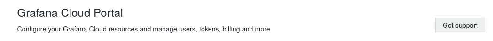
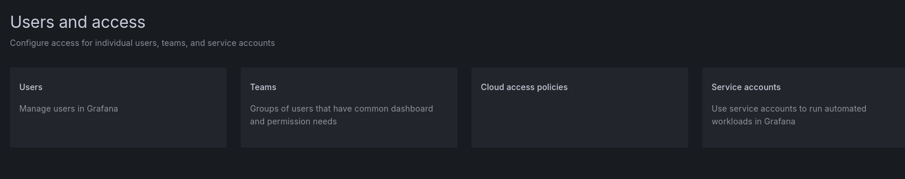
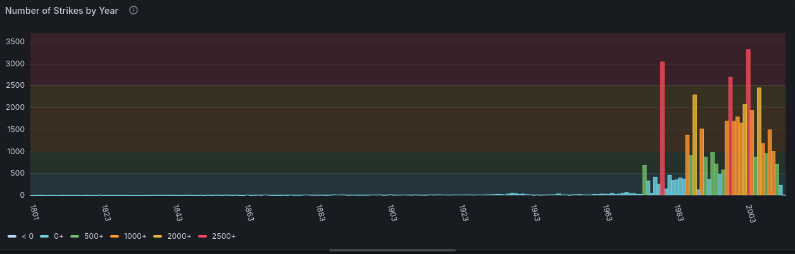

# Data Visualization with Grafana Cloud 
June 2025 

## What is Grafana?
[Grafana](https://grafana.com/) is suite of software for **observability**. Grafana is a great tool for taking some of the headaches out of creating dashboards, visualizations, and analytics for datasets. 

Most of Grafana's software is open-source, meaning you can self host it, modify the software, or even develop your own plugins and data sources (we'll go over what those mean in a second). Grafana also lets you get started a little more easily with a free Cloud account. This is where we'll be starting today. 

I should mention, not 100% of the Grafana software is open source, so be aware, not all features are available for free. I am going to [link the documentation pages here](https://grafana.com/docs/grafana/latest/?pg=oss-graf&plcmt=hero-btn-2), Grafana can tags its documentation with Enterprise or Open Source tags, if you are unsure what is available where. Grafana does a good job breaking down how to install the software, what components are, and how to use them. 


## How to Run Grafana

Grafana can be **self-hosted**, meaning you could install the software on your own computer and run everything from inside your own system (Grafana does essentially boil down to a website, so if you wanted to access a self-hosted system from outside your network, you would need to buy a domain.) 

[Here are the instructions for installing Grafana on a local system](https://grafana.com/docs/grafana/latest/setup-grafana/installation/), if at some point you are interested in doing that. For our purposes, we are going to start by setting up a free Grafana Cloud account. 


## Data for Our Dashboard Today 
Today we'll be building a dashboard for the [NASA Meteorite strike dataset, linked here from Kaggle](https://www.kaggle.com/datasets/sujaykapadnis/meteorites-dataset). The csv file is located in the "data" folder of this workshop in the repository. You also should have a lot of fun watching me misspell "meteorite" about 20 times over the course of the workshop. This dataset includes the following columns, among others:

**name** - The name of meteorite
**reclat** - latitude of strike
**reclong** - longitude of strike
**year** - year found
**mass** - mass in grams of the meteorite

As we go through the dataset, we might notice that the csv file I have linked does not have 100% clean data, or data formatted exactly as we might want it. We will have to handle this in our dashboard. 

## Creating an Account in Grafana Cloud
To start, go to [https://grafana.com](https://grafana.com/). Click the blue "Create Account" button on the page and walk through the steps to create an account. I already have an account, so I will just sign in. 


When your account is created, it should bring you to your Grafana cloud portal. 



You should also see a banner with your username and "Manage your Grafana Cloud stack". You should see a blue button that says "Launch". Click the button to launch your cloud instance. 


This should bring you to your Grafana main cloud account page. I had a dashboard set up already to create this tutorial, but most likely you will not have anything under "Dashboards". 


## Settings for your Grafana Account
First, lets explore some Grafana account setting. The side menu bar has some helpful links. We can see options for Dashboards, Connections, and more. First, we will visit the "Adminstration" tab. Click the dropdown on the side menu under "Administration ".


Go ahead and click "General". You should see a screen with options for managing preferences and settings. 


If you click on "Default Preferences", it will take you to a screen where you can set some useful defaults, like your Organization name, your timezone, language etc. We won't change these for now, but they are here if you need them. 


Now, lets move to the "Users and access" dropdown under the "Administration dropdown on the side menu. 


That should bring to you the users and access landing page. This allows you to create users and teams of users, as well as control their types of access to the account. 



Go ahead and click "Users". This opens a page where you can see all the user accounts and logins. You can link to grafana.com to manager user access if desired. 

Feel free to poke through the administration settings page to get an idea of what you can set up and customize through Grafana. 

## Setting Up a Data Source 
**Data Sources** are methods of connecting to data **stored somewhere else**. Usually the data is located somewhere on the world wide web with a method of accessing it through HTTP or a database connection. Data Sources can include API endpoints, SQL database, csv files, etc. 

Data Sources are broken down by types in Grafana, with different data source types making different kinds of connections. Once you have set up a type of data source, you can connect it to your specific data collection. 

For this workshop, we are going to connect to the csv file that has the NASA data. We could directly upload the data via the datasource we set up, but I found that very unreliable when I tried it. I we can use the Github link to the csv file stored in my repo: 

https://github.com/marzeverett/Robotics_and_AI_Bootcamps_2025/blob/main/workshops/grafana_workshop/data/Meteorite_Landings.csv

OK, lets set up the source. Under the "Connections" tab, Click the "Data Sources" button. 


This should bring you to a page that looks like this. 


We will be using the "grafanacloud-infinity" data source type, as it will allow us to make the connections we need. Click the blue "add a new data source" button. That will bring you to this page:


Search "inifity" in the search bar, and click on the Infinity data source that comes up. 


This will bring you to the data source setup page. There won't be a whole lot we set up here, since this is not a very involved setup. You could however, tab through the sidebar options for the data source, adding reference URLs, query parameters, authentification, and more. You can also add global queries, which is handy. I would recommend, for this workshop, adding a different name to the data source. We'll call it 'Meteorite'. 


Now click the "Save & test" button at the bottom of the screen. This should bring a banner up at the bottom the screen telling you the settings were saved. 


We are ready to get into the dashboard part!

## Dashboard 
A **Dashboard** in Grafana is a collection of visualization panels which visualize and/or analyze your data, fetched by your data source. The Dashboards are the main feature of Grafana and what your team is probably using the most often. Setting up useful, responsive dashboards is what Grafana is all about. 

Let's start setting up our dashboard. Click the "Dashboards" button on the side menu. That should bring you to this screen. (Again, I have set up some dashboards with this account already, so your screen will likely look a bit different)


Click the blue "New" button, and select "New Dashboard". This will bring you to a blank dashboard page, with some options to start setting up your dashboard. You can also import other dashboards or import a panel you had saved to your library if applicable. 


Click the "+ Add Visualization" button to start. 


### Query
In order to add our first visualization, we need to query our data from our data source. When you add your first visualization, it will ask you to select the data source to use. Add the "Meteorite" datasource. That should bring you to the panel editor shown here. 


At the bottom, you can see a letter "A" with a dropdown. This letter "A" is a **query** of your "Meterorite" data source. By default, though, it is not querying our dataset. We will need to change some settings:

- Click on the letter "A" and rename it to something more useful. I'm naming mine "Meteorite Data"
- Under "Type" change it from "JSON" to "CSV"
- Under "URL", paste in the URL from the github data source (https://github.com/marzeverett/Robotics_and_AI_Bootcamps_2025/blob/main/workshops/grafana_workshop/data/Meteorite_Landings.csv)

Your screen should look something like this:


This is a good start, but the data is not yet very clean. We will need to add some data transformations. 

### Data Transformations
Data transformations allow you to convert, clean, and filter, and group data coming from a given query. This is very useful in our case, especially as most of the data is by default read in as a string. 

Click the "Transformations" tab next to the "Queries" tab. 


Click the blue "Add transformation" button. This brings up a panel with a ton of different transformations you can add. We will start with the "Convert field type" transformation. 


This should bring you to this page: 


There are several fields that come in as strings we want to convert to numbers. We will use the dropdows and the "+ convert field type" button to convert the following fields:
- mass (g) to Number
- reclat to Number
- reclong to Number 
- year to Number 

Your screen will look like this:


We still want to do a little filtering. Click the "+ Add another transformation" button, and find the one that says "Filter data by values".


Go ahead and click this. That will put the following transformation below:


In the NASA Meteorite dataset, one meteorite strike was recorded mistakenly in a future year. Let's filter out the years we care about strikes to start in 1800 and end in 2026. 

- Leave Filter Type as Inclue
- Change Conditions to "Match all"
- Click "+ Add condition" 
- Set Field to "year"
- Change match "is null" to "Is greater"
- Change value from 0 to 1800 
- Click "+ Add condition" again
- Set Field to "year"
- Change match "is null" to "Is lower or equal"
- Change value from 0 to 2026 

Your screen should look like the one below: 


### Visualizations 

We have finished all our transformations for now. On the visualization panel on the right side of the screen, change the visualization to "Table". You should now see the table in the panel preview. 


In the right hand menu, you will see a lot of options for the visualization. These change depending on the type of visualization, and many control the variables displayed or the display settings. For now, under "Panel Options", we'll just chnage the Panel title to "Meteorite Table". 

You can also click the blue "Save dashboard" button (it may take a minute or two - adding a save message is optional) and then click the "Back to dashboard arrow". 


You should now be in your main dashboard view. 


You can grow or shrink your visualization panels, move them around the screen, or even change the global refresh rate (how often your query will be re-run) in this view. For now, we are going to focus on adding some more visualizations to fill up the screen area. 

### Text 
Let's add some text to the top of our Grafana Dashboard. Go to the "Add" dropdown at the top of the dashboard page and click "Visualization". 


The visualization will often default to Time series. Click the dropdown by "Time series" on the right hand panel menu and change it to "Text". 


Now let's change the panel options to something more useful.

- Under "Title" change the title to "Dashboard Header"
- You can leave the description blank
- The "Content" box is where you are writing your text. It supports markdown format (which this guide is also written in). Type the following text:

```bash
    # Meteorite Dashboard
    A dashboard to visualization NASA meteorite strike data 

```


You can save and go back to your main dashboard. You can resize, move, or reposition your text panel however you'd like. 


### Geomap
One of the most striking visualizations to add is the Geomap panel. We don't want to rewrite our query, though, so we are going to duplicate the Meterorite Table visualization and turn it into a GeoMap. 

On the Meteorite Table panel, click the three dots in the top right corner. 


Click "More" and then "Duplicate". 


On one of your 2 tables, click the three dots, and then "Edit". That should bring you back to the edit view. Change the Visualization type to Geomap.  


Now we can make some nice visualizations. Under Panel Options, change the following:

- Title - Strike Size by Location
- Description - A map of meteorite strikes, scaled by size
- Map View - Change 'Zoom' to 2


Scroll down a bit. Under map layers:
- Change Location Mode from "Auto" to "Coords"
- Change Latitude field to reclat
- Change Longitude field to reclong (This is where your map should suddenly populate!)
- Change Size from "Fixed Value" to "mass (g)"


You now have a map of meteorite strikes, scaled by size!
There are LOTS of other great map features, including text labels, that we don't have time to get into. This is a good starting spot. 

Go ahead and save (may take significantly longer - this is a big visualization) and go back to the dashboard. You can position the map where you want it. You can also scroll in and out of the map, and should be able to get more info on the datapoints on hover. 


### Stat

Sometimes, it's cool to get a called-out statistic you want to highlight in the dashboard. To do that, we'll use the "Stat" visualization. Duplicate the Meteorite table again like last time, and then open the edit field. Change the Visualization type to "Stat". 


By default, it is going to try and get a stat for all the numeric fields in the query. We want to change this to just giving us the largest mass of a meteorite strike. Make the following panel changes:

- Title - Largest Strike Mass
- Calculation - Max
- Fields - mass (g)


Then save, go back to dashboard, and position. 


### Bar Chart 
Another thing that might be interesting to know is the number of strikes by year. We will visualize this with a Bar Chart. 

Duplicate the Meteorite Table again, open it with "Edit", and change the visualization type to "Bar chart" 


For this chart, we actual need to group the data by year. To do that, we'll be adding another transformation type. Go the tranformation tab on the bottom, and click "+ Add another transformation" at the bottom of the screen. Then choose "Group by".


Change the following: 

- year - "Group by"
- mass (g) - Calculate - then select stats - Count (You could really do this on any field, since it is a count)


We are going to add one more transformation. Add a transformation, click "Sort by" and change the field to "year". 


Now we can make our bar chart. Go to the panel setting and change:

- Title - Number of Strikes by Year
- Description: Count of Strikes grouped by Year Found
- X Axis - year
- Rotate x axis tick labels - 75
- X-axis label minimum spacing - Small


This is a good chart - but let's make it even better. We set color by threshold to give us a more visual way of determining high-count years. Scroll all the way to the bottom of the panel options until you see "Thresholds". 
- Change the red 80 Threshold to 2500
- Click "+ Add threshold", make the color yellow, and change the number to 2000 
- Click "+ Add threshold", make the color orange, and change the number to 1000 
- Click "+ Add threshold", make the color green, and change the number to 500 
- Click "+ Add threshold", make the color blue, and change the number to 0 
- Change the base color to white. 
- If you want you can also change "Show Thresholds" to a more visual mode. I'm changing mine to "As filled regions".




Save the panel and go back to the main dashboard. Position the screen where you want it. 


## Open-Meteo

All right, our Dashboard is now looking *pretty* cool. But, I know what you're thinking -- what's the point of having a nice dashboard if I can't see what the current weather is? 


Actually, I think you would be a little bit surprised by how often you might want to add weather to something. 

To do this, we are going to be using the [Open-Meteo Website, Linked Here](https://open-meteo.com/)

Open Meteo provides free weather API calls, without needing a key, which is very nice. They do have a limit to the number of calls you can make per day, which we are unlikely to exceed in this workshop. 

We will generate an URL which will return some current weather data we want. Then, we can use this API call URL in Grafana to display the data, and refresh it periodically. 

Go to: https://open-meteo.com/


Click "Try the API here" 


This brings up a screen with many options. For this workshop, we are only interested in current weather data, not the forecast. For starters, I will change the latitude and longitude to CDA, ID, and the Timezone to reflect where I live. 

- Latitide - 47.6735
- Longitude - -116.7812
- Timezone - America/Los Angeles

Go ehad and deselect "Temperature" from hourly variables as well. 


Scroll down to "Current Weather":

- Check "Temperature (2 m)
- Check Relative Humidity (2 m)

In Settings:
- Change Temperature Unit to Fahrenheit 


Scroll down to the "API Response" section and click "Reload Chart" 


In the API URL section, copy the URL string. This is what we are going to use in the Data Source.


Open a new browser window and paste the API url in. This should give you an idea of the JSON structure of the response. 


## Adding the Weather to Our Dashboard 


Head back to your Grafana Dashboard. Create a new visualization by clicking "Add" -> "Visualization". 

In the Queries tab at the bottom:
- Change the datasource back to our meteorite infinity source
- Leave "Type" as JSON
- Paste your API URL into the URL box
- Click the dropdown next to "Parsing options & Result fields"
- Under Rows/Root type "current", all lowercase. This tells the query you only want the fields nested under the "current" heading in the JSON dictionary. 


Now, in the panel options:
- Change the Visualization to "Stat" 
- Change the Title to "Current Temp"
- Change the Fields option to "temperature_2m"


If you want, you can have this auto-refresh. Just make sure you stay under the call limit. On top of the preview, I will change the refresh rate to "30m".


I'm going to add another text visualization to label my weather fields. My dashboard now looks like this. 


Finally, I will duplicate the temperature visualization and change the field to humidity. 

My final dashboard looks like this:


## Final Thoughts
We have barely scratched the surface of what Grafana is capable of, but hopefully you come away with some ideas of where to go next. 

If you are more on the development side, Grafana supports developed plugins, including new or modified data sources, new visualizations, and more. I have installed plugins a few different times to be able to connect with some sources in a local installation that aren't available by default. 


Happy Visualizing! 


