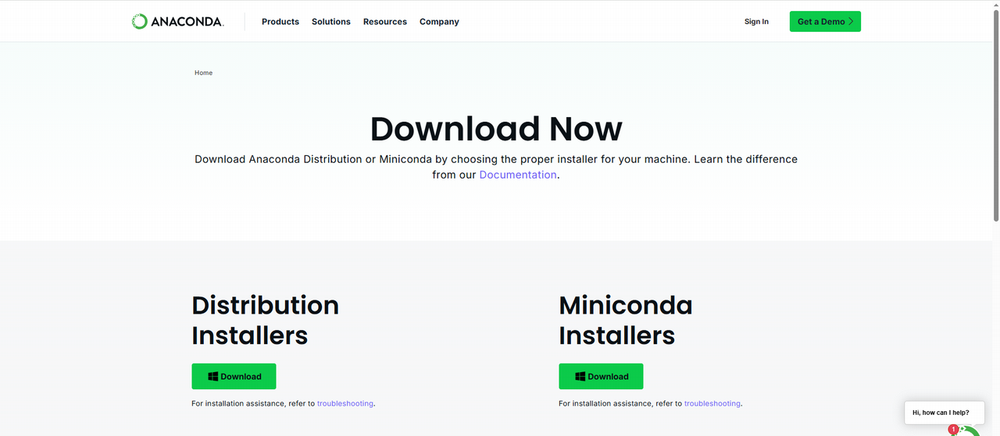
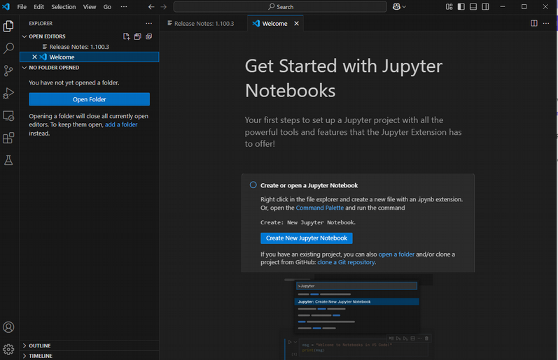

# Installing Anaconda for Windows With VS Code as an IDE

## Installing Anaconda 
1. Go to the [Anaconda Distribution Download Webpage](https://www.anaconda.com/download)


2. Click "Skip Registation", which should bring you to the download page. 



3. Find the distribution that matches your operating system (in this case, Windows) and click on the installer. 


4. This should start the installer download. 


5. Click on the downloaded executable to launch the installer. You may need to give your computer permission to run it. Click next to continue the install process. 


6. Read through and agree to the license agreement.


7. Click what users you want the distribution installed for. 


8. You should be able to leave the default install folder where it is. 


9. The next window will ask about some default preferences. You should be able to leave them where they are at. 


10. This should start the Anaconda install process. This may take a minute. 


11. Click "Next" when the install completes. 


12. Click "Next" on the next screen. We aren't going to bother about Jupyter notebooks at the moment. 


13. Click "Finish" on the next screen. 


14. This should launch the Anaconda navigator. If not, you should be able to launch the navigator from the start menu on a Windows computer. 


The Anaconda naviagator provides a GUI for installing packages, creating environments, installing IDEs, and so forth. Most of the operations can also be done via the terminal (especially virtual environment creation), but the GUI can be nice to use especially if you are getting started. 

## Creating a Virtual Environment

15. Let's now create a virtual environment. On the side menu, click "Environments". This will bring up your installed virutal environments. You will probably only see the "base (root)" environment listed. This is your default environments. There are a list of installed packages to the right of the base environment. All virtual environments you create will inherit installed packages from the base. However, when you install a new virtual environment, any package you install in that environment will not translate back to your base. This where you want to be a little bit careful. Anything installed in your based environment will also be installed in all virtual environments -- but not vice versa. 


16. Click "Create" (button on the bottom menu with the plus sign) to create a new virtual environment. On the pop-up, title the new virtual environment what you want ("bootcamp" here) and click create. 


17. Your new virtual environment may take a minute or two to install. You can see the progress at the bottom of the navigator. 


18. When installed, you should see your new virtual 'bootcamp' environment in the side list. 


## Using the Anaconda Prompt
19. Anaconda navigator comes with a built-in command prompt called "Anaconda Prompt" (note -- if you are using a Mac device, this may not some installed by default. You will likely end up using the Mac OS System Prompt instead). You can search for it in your start menu. Go ahead and launch the Anaconda prompt. 


20. This will open the anaconda prompt. By default, conda is activated to your base environment. Note -- if you are using a system prompt or something similar, you may have to type 

```bash
    conda init
```

into the terminal to make sure it starts the conda software. 


21. You can activate your new virtual environment in the Anaconda prompt by typing 

```bash
    conda activate bootcamp
``` 
where "bootcamp" is the name of your virtual environment. The terminal prompt should come up with your virtual environment name in parentheses. 


## Download Visual Studio Code

22. Next, we'll download Microsoft Visual Studio Code. **NOTE** - Visual Studio Code is very different from Visual Studio. Don't accidentally download visual studio - it is a massive amount of software! You can visit the [download page here](https://code.visualstudio.com/download)

23. Click and download the correct distribution for your system.


24. This will bring you to a "Thank you for downloading" page. Go ahead and click the executable when it is finished downloading


25. You'll need to agree to the license agreement. 


26. Default installation location should be fine. Click "next". 


27. The default start menu folder should also be fine. Click "next". 


28. You can select additional tasks if you want. The one I would recommend selecting is creating a Desktop shortcut. 


29. Now you should be able to click "Install". This may take a few minutes. 


30. The application will begin installing. 


31. Click "Finish" when it has finished installing. 


## Install the Python VS Code Extension 

32. This will probably launch the application.If note, you can start it from the start menu. The first thing we will do is install the extension for Python. This will help VS Code correctly interpret your files and can provide some useful debugging tools via the GUI. Click the block symbols at the bottom of the leftside menu to access the "Extensions" menu. 


33. Type "Python" in the search bar and click on the Python extension. Click "install extension" (I had this already installed, so "Restart" is my only option here)


## Create and Run a Small Python Program 

34. Once the extension is installed, you will want to test your setup. We are going to create and run a small python program to ensure everything is configured properly with the virtual environment and the terminal. Click the file symbol on top of the leftside menu and then click "open folder" to open a folder inside of VS Code. 



35. Browse for a folder you want to open. I named mine "code_practice". 


36. You may have to tell VS Code to trust the authors of the folder. 


37. Now, you are inside the folder. It will probably display a welcome message. Click the "code_practice" dropdown in the explorer left tab. 


38. You should see a little file symbol with a plus. Click on it to create a new file. 


39. Name your new file "hello_world.py" and press enter. This should open the file in VS Code. 


40. You will type:

    print("Hello, World")

in the file. You have officially written a line of python code. There might be a little white dot on top of the file. This means the file has changes in it that have not yet been saved. 


41. You can save the file by pressing cntrl+s on your keyboard or by using the menu to go File -> Save. 

42. Next, we will want to make sure VS Code is set up with the correct interpreter. Go to the command palette by pressing cntl+shift+p on your keyboard or by going View -> Command Palette. This should open the palette. You'll want to type "Pyton: Select Interpreter". It should autocomplete if you start to type this. 


43. Select the interpreter that has your virtual environment name (in my case, Python 3.12.9 "bootcamp")


44. Now, you will want to open a terminal. You can click View -> Terminal to accomplish this. 


45. A terminal should come up at the bottom of the screen. It might default to the windows powershell terminal, which in this case we don't really want to use. 


46. Click the "+" sign at the top of the terminal window. Select "Command Prompt".


47. This should bring you into an anaconda-like prompt. You should see (base) or (bootcamp) in front of the prompt. If you don't see any environment activated, type 

```bash
    conda init
```
in the terminal.


48. If your virtual environment is not active, type 

```bash
    activate bootcamp
```

in the terminal. 


49. Your environment should now be active in the terminal!


50. Now type 

```bash
python hello_world.py
``` 

into the terminal to run the python program. (Depending on your installation, you may need to type "python3" instead of python.) This tells your terminalto run the python software on your python script named "hello_world.py"  This will run the only command written in your program, which is to print "Hello, World!" to the screen. 


51. Now we can test the impact of the virtual environment. We will install a package called "pandas" into the virtual environment. Type 

```bash
    conda install pandas
``` 

into the terminal window and press enter. 


52. This should install the software. 


53. Now type "import pandas" at the top of your python file. Your script should now look like:

    import pandas
    print("Hello, World")

And in your terminal, if you run 

```bash
    python hello_world.py
```
again, you should get the same output. If the package hadn't installed correctly, you would get an error on import that you don't have the pandas packages installed. If that happens to you, make sure your virtual environment is active, and make sure you conda installed the package into the correct environment in the first place. 


54. If need be, you can also deactivate your virtual environment by typing 

```bash
    conda deactivate
```
into the terminal. 

55. We can also run python files from the Anaconda prompt. Go ahead and open the Anaconda prompt from the start menu. 


56. Get into the folder that has your python file. You can do that by typing "cd" followed by the file path. In my case, I type

```bash
    cd Documents/code_practice
```


57. You'll want to activate your virtual environment by typing 

```bash
    conda activate bootcamp 
```


58. Now if you type 

```bash
    python hello_world.py
```

You should see the same "Hello, World" output. 


## Useful Terminal Commands
There are some terminal tips and tricks that are handy to know when beginning programming.

1. Pressing the "tab" key tries to autocomplete what you are typing. This is useful when you have a long file name -- if you start typing the file name you can tab to complete it, so long as there are no other naming conflicts. 

2. Pressing the up arrow on the terminal cycles through your most recent commands, you don't don't have to re-type the common ones all the time. 

3. "cd" on both Windows and Linux allows you to change a directory. You type cd followed by the filepath. 

```bash
    cd Documents
```
for example, will change your terminal's current directory to exist inside the Documents folder. 

If you need to go up one directory, type 

```bash
    cd ..
```

### Windows Useful commands

```bash
    dir
```
lists all the files in a directory 
```bash
    ls
```
does the same in a Linux system. 

```bash
    cls
```
clears all the output currently in your terminal. 

```
    clear
```
does the same in Linux. 

## Troubleshooting
1. My anaconda environment says it's activated, but it's missing packages that should be installed!
- Make sure your environment was activated when the package was installed. You may need to reinstall
- Make sure your interpreter is set correctly 
- Make sure you are using the correct python vs python3 command - ESPECIALLY if you have a base python installation on your computer already 

2. My python version is printing out wrong. 
- Make sure you installed your virtual environment with the version of python your intended 
- Make sure you are using the correct python vs python3 command 


