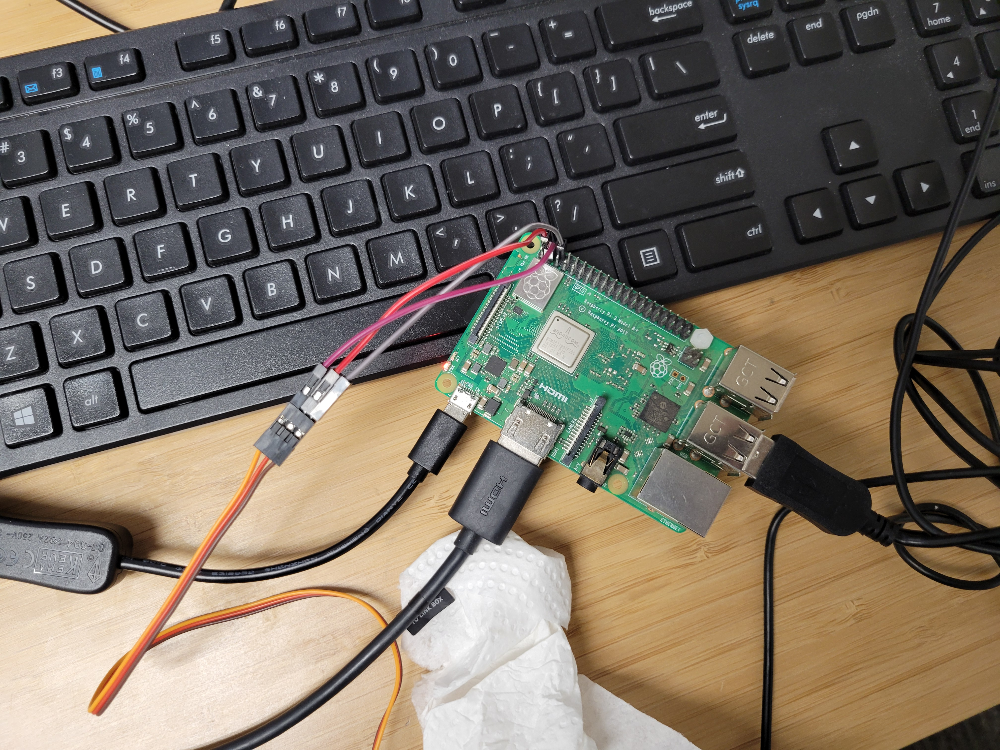
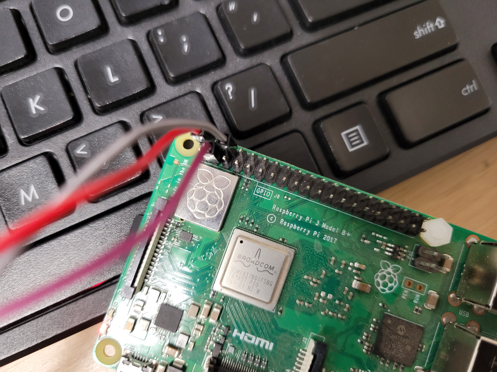

# Raspberry Pi Workshop 
June 2025
We are following the tutorials and code directly from [this Instructables website](https://www.instructables.com/Servo-Motor-Control-With-Raspberry-Pi/)

## Materials
(Recommended) - Python installed on your computer 
1 Raspberry Pi Computer 
1 Raspberry Pi Power Supply
1 HDMI Cord
1 SD Card
1 Keyboard
1 Mouse
1 Monitor
1 Mini Servo Motor
3 M-F Jumper Wires 

## What is a Raspberry Pi Computer?
Raspberry Pi Computers are another type microcontroller, put out by the [Raspberry Pi Foundation](https://www.raspberrypi.org/). These are very popular devices, as they are low-cost and fairly powerful for embedded applications. Different from the Arduino, a raspberry pi can run a complete Linux operating system - you can interact with a Pi like you can with a regular computer, complete with a keyboard, monitor, and mouse. However, it is easier to connect to and directly interact with embedded system peripherals with a raspberry pi versus a regular computer. The Pi also is a compact size and requires less power than a normal computer. 

Of course, you mostl likely aren't going to be running a video server or playing Call of Duty on a Raspberry Pi - it doesn't have enough compute power. It's also not as low power as an Arduino. Pi's are popular because they strike a good balance between low level microcontrollers and a fully fledged server. At the Center for Intelligent Industrial Robotics, we use Raspberry Pi's all the time, in a huge variety of projects. 

The model we are using for this class is a Raspberry Pi 3B+. The latest model is a Raspberry Pi 5. The 4 and 5 are much faster than the 3B+, but require quite a bit more power. For our outdoor sensing, we like the 3B+ since it is less of a power hog. Also, it's cheaper. 

The Pi 3B+ has:
- built in Wifi (really handy - most Arduinos do not)
- built in Bluetooth (which sometimes conflicts with Wifi if they are both on at the same time)
- two rows of GPIO pins
- HDMI monitor connection
- Micro USB Power cord connection
- 4 USB ports
- 1 Ethernet port 

Today, we'll mostly be focusing on the GPIO pins. The Wifi connection though is really, really handy. 

## How do you interact with a Raspberry Pi? 
For this workshop, we are using a classic computer setup with a keyboard, monitor, and mouse. Pi's have a GUI, but is is often slow and cumbersome. I would highly recommend writing the code out on your own system and then transferring it to the Pi (we'll go over that). 

You can get into the Pi "headless" (no monitor) by setting up ssh over a network, or setting up VNC, or TailScale or something similar. That is also very popular but requires a little more work. In general, it is nice to be able to skip a raspberry pi station setup if possible. 

## How do you set up a Raspberry Pi?
Pi's are interseting in that they don't really have a classic onboard harddrive like a regular computer - they use an 'image' (operating system) flashed onto a micro-SD card. These Pi's we are using we preinstalled, but usually the first step in booting up a pi is flashing your desired operating system onto the SD Card. Rpi-Imager is the software I usually use for this. I typically use a Raspberry Pi operating system version (based on debian Linux) on the Pi, since it comes with a lot of built in support for what I plan to connect as peripherals. However, you can also install Ubuntu and other operating systems on the Pi. 


## How do you program a Raspberry Pi? 
Since a Raspberry Pi runs a full operating system, there are several different languages you can program it in. C/C++ and Python are popular. For this workshop, we are using python. 


## What are GPIO Pins? 
GPIO Pins are general purpose input/output pins, often abbreviated to GPIO or even just IO pins. These allow you to connect electrically with other components, either to control them or to read from them. We will be connecting the GPIO pins to the servo motor in this workshop in order to control it. 

## What is a Servo Motor and Pulse Width Modulation? 

[We are going to watch this video, which provides a great explanation.](https://youtu.be/1WnGv-DPexc?si=_NUsalyGqLtr54ib)


## Wiring Up the Servo Motor 
[Here is a Link to a Helpful Pinout Diagram](https://www.jameco.com/Jameco/workshop/CircuitNotes/raspberry-pi-circuit-note.html)
- Brown - Ground
- Red - Power
- Yellow - Signal (PWM - Pulse Width Modulation)




Following the linked tutorial, I used pin 2 for power, pin 6 for ground, and pin 3 for the signal. 

## Program Walkthrough 
Again, taking directly from [the tutorial here.](https://www.instructables.com/Servo-Motor-Control-With-Raspberry-Pi/)

    import RPi.GPIO as GPIO

This python function allows us to access the GPIO pins on the Raspberry pi. This is good, since we need to send the signal to the motor on one of the pins. 

    from time import sleep

this will allow us to write in pauses to our program, like the Arduino 'delay' function. 

    GPIO.setmode(GPIO.BOARD)

There are different pin modes, setting it to this modes allows us to access the pins correctly by pinout number. 

    GPIO.setup(3, GPIO.OUT)

This sets up pin 3 as an output. We did something similar with the Arduino pins. 

    pwm=GPIO.PWM(3, 50)

This sets the PWM output on pin 3 to 50Hz. 

    pwm.start(0)

This starts the pwm on pin 3 as 0, so nothing will move to start. 

    def SetAngle(angle):
        duty = angle / 18 + 2
        GPIO.output(3, True)
        pwm.ChangeDutyCycle(duty)
        sleep(1)
        GPIO.output(3, False)
        pwm.ChangeDutyCycle(0)

This function calculates the duty cycle needed on the motor given an angle. It then changes pin 3 to be an output, sends the duty cycle (which will move the servo to that angle), delays to allow the motor time to move there, and sets revoke's pin 3 as an output, before changing the duty cycle back to 0. 

    SetAngle(90) 

This uses the function, and will turn the motor ~90 degrees. 

    pwm.stop()
    GPIO.cleanup()

These lines at the end clean up and exit our pwn and GPIO pins. 

## Testing the Program 
Scp command

Open a terminal in the pi. Run 

```bash
ifconfig
```
You should be able to see an ip address. If your computer is connected on the same network, you can transfer your file to the pi using the scp command. If the file name on you computer is "servo_control.py", then (in a terminal open to the same folder as your file location) you could run:

```bash
scp servo_control.py pi@<ip_address>/home/pi/servo_control.py
```
with the password for the pi being the default, "raspberry". 

This will put the file in the home directory. Then, on the pi, you can run 

```bash
python3 servo_control.py 
```
to move the motor. 

## Play around. 
I encourage you to play around with different angles and delays. You can also use the python input command, if you want, to be able to type in angles dynmically. 

## Raspberry Pi's in the 'Wild' (Quick tour of Embedded Systems Development in the Robotics Lab)
- We have many of these in play!
- SCARECRO
- ROS2 Network Testing
- Gripper Control
- etc, etc 

## Resources 

[Raspberry Pi Foundation](https://www.raspberrypi.org/)
[Instructables Tutorial](https://www.instructables.com/Servo-Motor-Control-With-Raspberry-Pi/)


